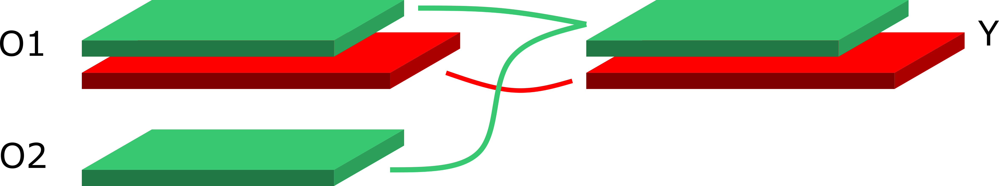

Getting started
===============

In this tutorial we demonstrate how to create
observables from raw data

Understanding the internal structure
------------------------------------

`pyobs` is a library to manipulate observables. To do so a 
specific internal structure, transparent to the user, is defined
and implemented to properly propagate errors among observables
sharing data on the same configurations.

Observables defined from `pyobs.obs` contain 3 fundamental
sub-classes

:rdata: contains the fluctuations on a given replica, ie on a set of configurations
    generated from a unique Markov Chain (stream). 

:mfdata: contains the fluctuations on a master field, ie on a set of points
    generated from a unique master-field like configuration.

:cdata: contains the covariance matrix of observables for which the original
    fluctuations are not available, or that are obtained from different sources
    like experimental numbers.

When a new observable is created, one of the three sub-classes is automatically
generated, while the others are left empty. During the analysis, when the 
different observables are combined together to extract new results, the library
`pyobs` automatically takes care of combining data where it overlaps, ie 
taking correlations into account, and merging the sub-classes appropriately.

The three sub-classes are collected in dictionaries, whose key uniquely 
defines the replica, master field or covariance data. When different observables
are combined together via some operation, these keys are used to identify
the places where correlations have to be propagated.

In the image above the green block represents a replica for example, with 
key `green`. When the two observables :math:`O_1, O_2` are combined 
via a binary operation :math:`f(O_1, O_2) = Y`, correlations are properly
propagated. The red block represents a replica with a different key, or 
a master-field or covariance data.

Creating the observables
------------------------

In this example we assume to have the measurement of a scalar quantity,
like the plaquette, on several gauge field configurations, stored in a 
python list, or in a `numpy.array`

.. code-block:: python
   
   >>> import pyobs
   >>> data = [0.198553, 0.202273, 0.202035, ... ]
   >>> len(data) # print number of configs
   400
   >>> obsA = pyobs.obs(desc='obsA')
   >>> obsA.create('EnsA',data)
   >>> # obsA.create('EnsA',numpy.array(data)) would be equivalent
   >>> print(obsA)
   0.200(13)

Above we have not specified the index of the configuration corresponding
the measurement contained in `data`: in this case the library assignes the index
0 to the first configuration and assumes a contiguous data set with increment of 1.
The input parameter `icnfg` can be used to provide more accurate information:

.. code-block:: python

   >>> idx = [0, 2, 4, 6, ...] # measurements on all even configs
   >>> obsA.create('EnsA',data, icnfg=idx)
   >>> idx = [0, 1, 4, 5, 6, 9, 10, 11 ..] # arbitrary subset of configs
   >>> obsA.create('EnsA',data, icnfg=idx)

In the examples above we have only presented the case of an observable measured
on a single replica. In all cases we are passing the string `EnsA` which is used
by the library to automatically generate the key for the `rdata` instance that
is created inside `obsA`. What if we have several replicas for the same ensemble?

.. code-block:: python

   >>> idx_r1 = [0, 1, 2, 3, 4, ...] # config id 
   >>> data_r1 = [0.198553, 0.202273, 0.202035, ... ] # replica 1
   >>> len(data_r1) # print number of configs
   400
   >>> idx_r2 = [4, 6, 8, 10, ...] 
   >>> data_r2 = [0.19945, 0.19785, 0.21045, ... ] # replica 2
   >>> len(data_r2) # print number of configs
   600
   >>> obsA = pyobs.obs(desc='obsA')
   >>> obsA.create('EnsA', [data_r1, data_r2], icnfg=[idx_r1, idx_r2])

A new observable with the information from the two streams/replica can be defined 
by packing the two data arrays in a python list; similarly to specify the configuration
indices for the two replicas, a list with two arrays must be passed as `icnfg`.
The advantage of this functionality is that the central value if defined from the 
global average of `data_r1` and `data_r2` and the fluctuations are defined by subtracting
this global average from the two replicas, at once.

.. note::

   The various replicas must be defined for the same ensemble. Trying to combine in this 
   way measurements from different ensembles leads to incorrect results and behavior.

The program automatically assigns a name to the various replicas, simply given
by the index of the corresponding data array, ie 0, 1. Custom names can be also 
be specified via the input field `rname`

.. code-block:: python

   >>> obsA.create('EnsA', [data_r1, data_r2], icnfg=[idx_r1, idx_r2], rname=['r001','r002'])
   >>> obsA.peek()
   Observable with dims = (1,)
    - description: obsA
    - size: 96 KB
    - mean: 0.20007161
    - Ensemble EnsA
       - Replica r001 with mask [0] and ncnfg 400
            temporary additional memory required 0.015 MB
       - Replica r002 with mask [0] and ncnfg 600
            temporary additional memory required 0.015 MB

As a final step, we examine how to create multi-dimensional observables, such as vectors, 
matrices and more complicated tensors. Let's consider the case of a 2-D tensor with 
dimensions (4,64), for example four correlators measured on 64 time slices and on 
400 configurations. By organizing the data such that for every configuration the fastest
index corresponds to time, we can define an observable with dimensions (4,64) as follows

.. code-block:: python

   >>> for i in range(400):
   >>>    for c in range(4):
   >>>       for t in range(64):
   >>>          data[i,c*64 + t] # the fastest index corresponds to t
   >>> data = numpy.reshape(data, (numpy.size(data),)) # flatten data to be 1-D, t still fastes index
   >>> corrs = pyobs.obs(desc='correlators')
   >>> corrs.create('EnsA', data, dims=(4,64)) # dims reflects layout of data

All the features related to multiple replicas and configuration indexing can be applied
as described before.

Creating master-field observables
---------------------------------

The creation of observables with the master-field paradigm is straightforward.
The concept of measurements per configuration is replaced by the measurement per site, 
which means that `icnfg` can be used to specify on which sites the measurement has been
performed; the concept of replica is replaced by statistically independent master-fields, 
and the size of the field must be passed as an additional argument.

.. code-block:: python

   >>> sites = [0, 1, 4, 5, 8, ...] # the sites where the observable is known
   >>> data = [0.198553, 0.202273, 0.202035, ... ]
   >>> len(data) # print number of sites
   400
   >>> obsmf = pyobs.obs(desc='master-field test')
   >>> obsmf.create('MF0', data, icnfg=sites,  lat=[32,32,32,32])

Lexicographic order is used to interpret the field `icnfg`, together with 
`lat` which specifies the number of sites per direction and the total number 
of directions

.. math::

   s = x_{D-1} + L_{D-1} (x_{D-2} + L_{D-2} ( \cdots x_1 + L_1 x_0 ))

.. code-block:: python

   >>> data = [0.19845, 0.20984, ...] # measurements on all sites of a time-slice
   >>> obsmf = pyobs.obs(desc='master-field test')
   >>> obsmf.create('MF0', data, lat=[32,32,32]) # no need to specify icnfg

If several master fields are available there are essentially two possibilities

* if the data is known *exactly* on the same sites for all fields, possibly all, 
  then following the suggestion by M. Luescher is the best choice for performance:
  average all fields together and just pass a single master-field to `obs.create`

* if the data is known on different sites on the various fields, then pass data
  as a list, such that all master fields are treated differently. 

